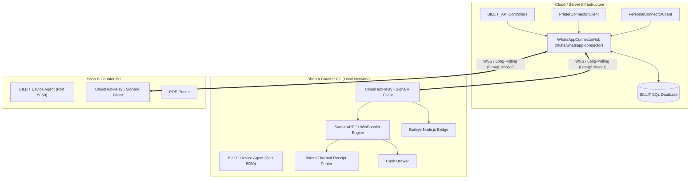
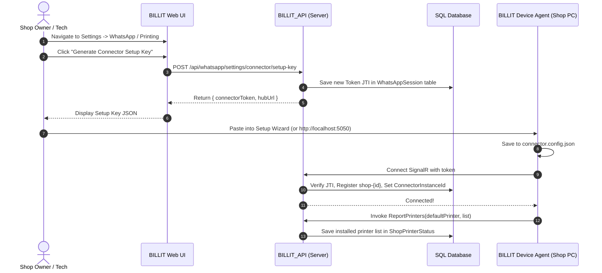
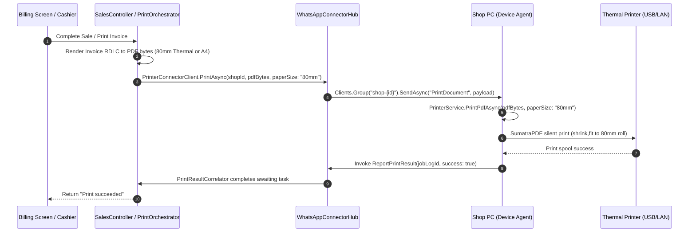
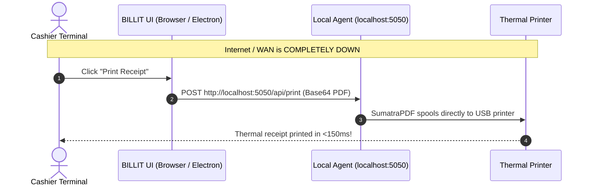
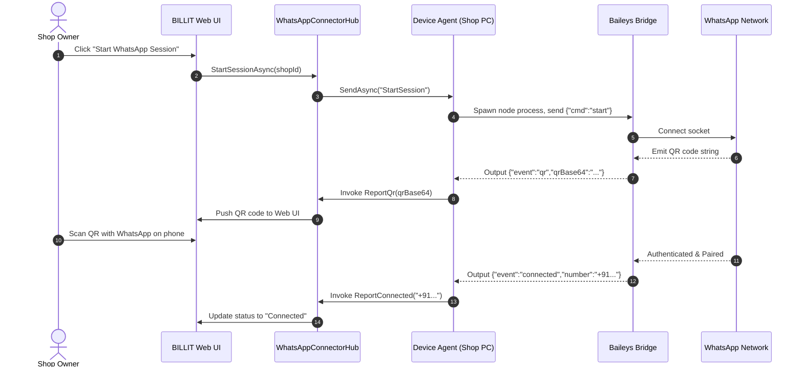

# BILLIT Cloud Hub & Local Device Agent: Complete Architecture & Deployment Guide

## Executive Summary

The **BILLIT Device Agent** is a lightweight Windows Service installed on a shop's POS/counter computer. It bridges the gap between the cloud-hosted **BILLIT_API** and physical hardware (thermal receipt printers, cash drawers) and local messaging channels (WhatsApp Web/Baileys).

This document explains the technical architecture, SignalR hub connection protocol, multi-tenant shop isolation, failover resilience, and the exact rollout procedure for onboarding retail shops.

---

## 1. System Architecture & Component Mapping



### Roles & Responsibilities

| Component | Location | Primary Role |
| :--- | :--- | :--- |
| **`WhatsAppConnectorHub`** | `BILLIT_API/Hubs` | Central SignalR WebSocket gateway. Authenticates agents, manages shop groups (`shop-{id}`), and dispatches jobs. |
| **`IConnectorTokenService`** | `BILLIT_Infrastructure` | Issues long-lived cryptographic JWT tokens tied to a specific `master_shop_id`. |
| **`CloudHubRelay`** | `BILLIT Device Agent` | Background worker on shop PC. Connects out to the Hub, listens for commands, and reports results. |
| **`PrinterService`** | `BILLIT Device Agent` | Independent printing engine. Executes silent PDF printing and raw ESC/POS commands (drawer kick, paper cut). |
| **`WhatsAppCoordinator`** | `BILLIT Device Agent` | Multi-mode WhatsApp driver (Disabled, Local Baileys Bridge, or Meta Cloud API). |
| **Local REST API (`:5050`)** | `BILLIT Device Agent` | Local HTTP API allowing cashier web browsers to print directly with 0ms latency even when cloud is unreachable. |

---

## 2. Authentication & Multi-Shop Isolation Model

### 1. The Machine Token (JWT)
Each shop is provisioned with a secure, long-lived JWT generated by `ConnectorTokenService.cs`. The token payload contains:
```json
{
  "master_shop_id": "3",
  "token_use": "whatsapp-connector",
  "jti": "51f32e2c5e1c4ca69349e91bd2dc83cc",
  "iss": "BILLITAPI",
  "aud": "BILLITClient",
  "exp": 1943690077
}
```

### 2. Connection Handshake
1. When the shop PC boots, `CloudHubRelay` connects to:
   `wss://<YOUR_DOMAIN>/hubs/whatsapp-connector?access_token=<JWT_TOKEN>`
2. In `WhatsAppConnectorHub.OnConnectedAsync()`:
   - The server validates the token signature using `JwtSettings:Secret`.
   - Extracts the `ShopId` from claim `master_shop_id`.
   - Extracts the unique `jti` claim.
   - Queries table `WhatsAppSession` for that shop.
   - **Revocation Check**: If `session.ConnectorTokenJti != TokenJti`, the server rejects the connection with `TokenRevoked`.
   - **Group Registration**: If valid, the connection is placed into group:
     `shop-{shopId}` (e.g., `shop-3`).
   - Updates `session.ConnectorInstanceId = Context.ConnectionId` in DB.

> [!IMPORTANT]
> **Strict Multi-Shop Isolation**: Print commands and WhatsApp messages are dispatched strictly to `Clients.Group("shop-{shopId}")`. It is mathematically and architecturally impossible for Shop A's receipt or customer message to ever be received by Shop B.

---

## 3. End-to-End Workflow Lifecycles

### A. Shop Pairing Flow



---

### B. Remote Cloud Print Job Flow

When a cashier creates a bill from a browser, mobile phone, or cloud portal:



---

### C. Local Direct Print Flow (Offline Resilience)

If the shop's internet goes down, the POS counter **never stops**:



---

### D. WhatsApp Session & Messaging Flow



---

## 4. SignalR Hub Contract Specification

### Hub Invocations (Connector -> Server)

| Method Name | Parameters | Description |
| :--- | :--- | :--- |
| `Heartbeat` | *none* | Pings server every 2 minutes; updates `LastHeartbeat` timestamp in DB. |
| `ReportPrinters` | `string? defaultPrinter, List<string> printers` | Transmits installed Windows printers and default printer to cloud DB. |
| `ReportPrintResult` | `long printJobLogId, bool success, string? error` | Confirms execution of a remote print job. Unblocks waiting cloud callers. |
| `ReportQr` | `string qrCodeBase64` | Transmits live QR code for display in the cloud web UI. |
| `ReportConnected` | `string number` | Reports phone number linked via QR code scan. |
| `ReportDisconnected`| `string? reason` | Notifies server that WhatsApp session disconnected. |
| `ReportExpired` | *none* | Signals that session credentials expired (prompts fresh QR). |
| `ReportSendResult` | `long messageLogId, bool success, string? msgId, string? err` | Confirms whether WhatsApp message was delivered to recipient. |

### Server Push Commands (Server -> Connector)

| Command Name | Arguments | Description |
| :--- | :--- | :--- |
| `"PrintDocument"` | `{ printJobLogId, fileName, printerName, copies, paperSize, fileBase64 }` | Instructs agent to print a PDF silently with paper settings. |
| `"PrintRaw"` | `{ printJobLogId, printerName, rawBase64 }` | Instructs agent to spool raw ESC/POS bytes. |
| `"OpenCashDrawer"`| `{ printerName }` | Generates ESC/POS pulse to open cash drawer. |
| `"CutPaper"` | `{ printerName }` | Sends ESC/POS feed-and-cut sequence. |
| `"ListPrinters"` | *none* | Requests agent to re-enumerate Windows printers and report back. |
| `"StartSession"` | *none* | Commands agent to launch WhatsApp bridge and generate QR code. |
| `"Disconnect"` | *none* | Commands agent to log out and terminate WhatsApp session. |
| `"SendText"` | `{ messageLogId, to, message }` | Transmits text message to recipient mobile number. |
| `"SendDocument"` | `{ messageLogId, to, caption, fileBase64, fileName }` | Transmits PDF document / invoice to recipient mobile number. |

---

## 5. Server-Side Prerequisites & Verification

Before rolling out connectors to shops, ensure the following are running on your server:

1. **JWT Secret Configuration** (`appsettings.json` in `BILLIT_API`):
   ```json
   "JwtSettings": {
     "Secret": "YOUR_STRONG_HMAC_SECRET_KEY...",
     "Issuer": "BILLITAPI",
     "Audience": "BILLITClient"
   }
   ```
2. **SignalR Hub Route**:
   In `Program.cs`:
   ```csharp
   app.MapHub<WhatsAppConnectorHub>("/hubs/whatsapp-connector");
   ```
3. **Database Tables Exist**:
   - `WhatsApp_Settings` (stores `Mode`, `Provider`, credentials)
   - `WhatsApp_Sessions` (stores `ConnectorTokenJti`, `ConnectorInstanceId`, `Status`, `ConnectedNumber`)
   - `Shop_Printer_Status` (stores `AvailablePrintersJson`, `DefaultPrinterName`, `LastHeartbeat`)
   - `Printer_Settings` (stores `IsEnabled`, `PrinterName`, `Copies`, `PaperSize`)
   - `Print_Job_Logs` (stores job history and status)
   - `WhatsApp_Message_Log` (stores message logs)

---

## 6. Shop Counter Rollout Runbook (Step-by-Step)

Follow this exact checklist when setting up a new retail shop:

### Step 1: Copy Deployment Folder to Shop PC
Place the compiled connector folder on the shop computer (e.g. `C:\BILLIT_Agent\` or `C:\Program Files\BILLIT\DeviceAgent\`).
Verify folder contents:
- `BILLIT_WhatsAppConnector.exe`
- `tools\SumatraPDF.exe`
- `bridge\billit-wa-bridge.js` and `bridge\node_modules\`
- `appsettings.json`

### Step 2: Install as Windows Service
Open **Command Prompt (Run as Administrator)** and execute:
```cmd
cd C:\BILLIT_Agent\
BILLIT_WhatsAppConnector.exe --install
```
This registers the service to start automatically on Windows boot and configures automatic restart recovery on failure.

### Step 3: Pair Shop with Cloud Server
1. On the shop PC, open a browser and go to:
   `http://localhost:5050/`
2. You will see the **BILLIT Device Agent Control Panel**.
3. In BILLIT Web Portal, open **WhatsApp Settings** -> click **Generate Connector Setup Key**.
4. Copy the setup key JSON and paste it into the Control Panel (or run `BILLIT_WhatsAppConnector.exe --setup`).
5. Click **Save & Connect**.
6. The status badge will change to **Connected**!

### Step 4: Verify Hardware
1. On `http://localhost:5050/`, check that the shop's thermal receipt printer (e.g. Epson, TVS, Canon, Xprinter) is listed under **Installed Printers**.
2. Click **Print Test Page** -> verify the receipt prints and cuts cleanly.
3. Click **Open Drawer** -> verify the cash drawer pops open.
4. If WhatsApp is enabled, scan the displayed QR code with the shop owner's mobile phone.

### Step 5: Ready for Operations!
Billing and invoice printing will now work seamlessly both from the cloud portal and locally!
